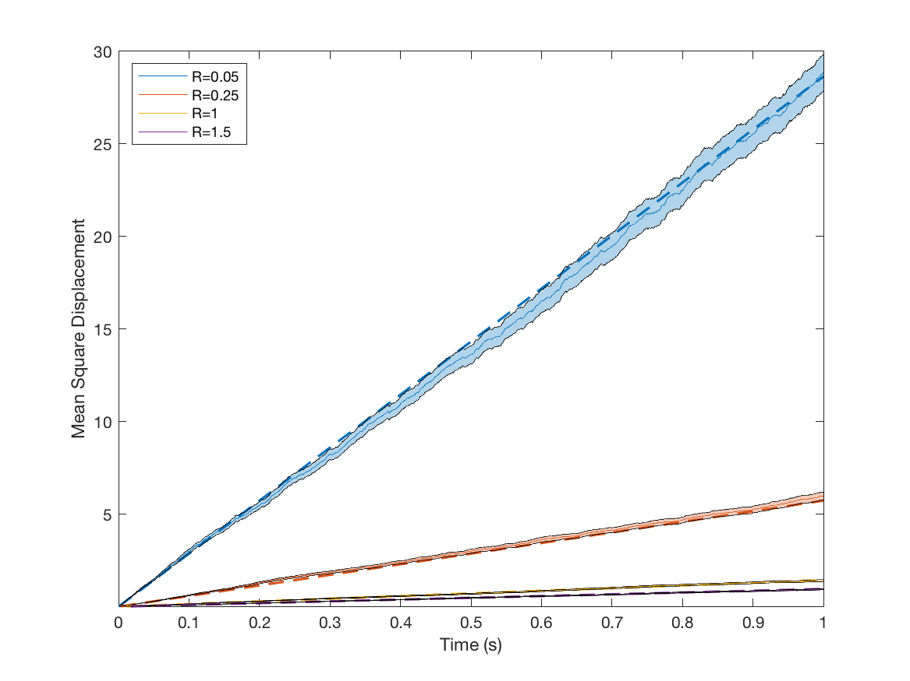

These are a series of tests which demonstrate the code conforms to expectations
in a variety of situations.

## Rates

### Off rate

### On rate

### Stepping rate

## Forces

### Radial Force

### Tangential Force

## Diffusion

### Cargo Translational Diffusion

### Cargo Rotational Diffusion

### Anchor diffusion in the cargo membrane

